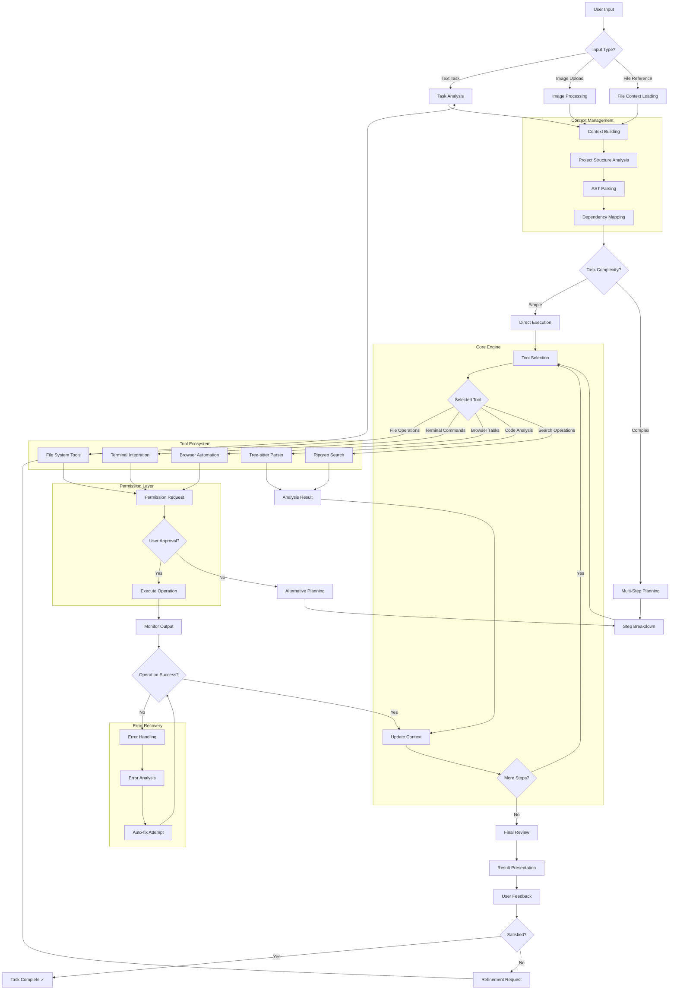

# Infinity – Unlimited Coding Possibilities ∞

<p align="center">
  
</p>

<p align="center">
  
</p>

<div align="center">
<table>
<tbody>
<td align="center">
<a href="https://marketplace.visualstudio.com/items?itemName=saoudrizwan.infinity-dev" target="_blank"><strong>Download on VS Marketplace</strong></a>
</td>
<td align="center">
<a href="https://discord.gg/infinity" target="_blank"><strong>Discord</strong></a>
</td>

</td>
<td align="center">
<a href="https://github.com/infinity/infinity/discussions/categories/feature-requests?discussions_q=is%3Aopen+category%3A%22Feature+Requests%22+sort%3Atop" target="_blank"><strong>Feature Requests</strong></a>
</td>
<td align="center">
<a href="https://docs.infinity.bot/getting-started/for-new-coders" target="_blank"><strong>Getting Started</strong></a>
</td>
</tbody>
</table>
</div>

Meet **Infinity** (∞) - an AI assistant that brings unlimited coding possibilities to your **CLI** and **Editor**.

Thanks to [Claude Sonnet 4's agentic coding capabilities](https://www.anthropic.com/claude/sonnet), Infinity can handle complex software development tasks step-by-step. With infinite potential for creating & editing files, exploring large projects, using the browser, and executing terminal commands (after you grant permission), Infinity assists you in ways that go beyond code completion or tech support. Infinity can even use the Model Context Protocol (MCP) to create new tools and extend its own capabilities infinitely. While autonomous AI scripts traditionally run in sandboxed environments, this extension provides a human-in-the-loop GUI to approve every file change and terminal command, providing a safe and accessible way to explore infinite possibilities with agentic AI.

## 🚀 How Infinity Works

1. **Set Your Vision**: Enter your task and add images to convert mockups into functional apps or fix bugs with screenshots.
2. **Infinite Analysis**: Infinity starts by analyzing your file structure & source code ASTs, running regex searches, and reading relevant files to get up to speed in existing projects. By carefully managing what information is added to context, Infinity can provide valuable assistance even for large, complex projects without overwhelming the context window.
3. **Unlimited Capabilities**: Once Infinity has the information needed, it can:
    - Create and edit files + monitor linter/compiler errors along the way, letting it proactively fix issues like missing imports and syntax errors on its own.
    - Execute commands directly in your terminal and monitor their output as it works, letting it e.g., react to dev server issues after editing a file.
    - For web development tasks, Infinity can launch the site in a headless browser, click, type, scroll, and capture screenshots + console logs, allowing it to fix runtime errors and visual bugs.
4. **Infinite Results**: When a task is completed, Infinity will present the result to you with a terminal command like `open -a "Google Chrome" index.html`, which you run with a click of a button.

> [!TIP]
> Use the `CMD/CTRL + Shift + P` shortcut to open the command palette and type "Infinity: Open In New Tab" to open the extension as a tab in your editor. This lets you use Infinity side-by-side with your file explorer, and see how it changes your workspace more clearly.

---

## 🏗️ Project Architecture & Modules


### Core Modules

#### 📋 **Core (`src/core/`)**
The heart of Infinity's intelligence and operations:

- **`webview/`** - Manages the VS Code webview lifecycle and UI rendering
- **`controller/`** - Handles webview messages, coordinates task management, and user interactions
- **`task/`** - Executes API requests, tool operations, and manages task state
- **`assistant-message/`** - Processes and formats AI assistant responses
- **`context/`** - Manages conversation context and memory
- **`prompts/`** - Contains system prompts and prompt management
- **`tools/`** - Implements various development tools (file operations, terminal, browser)
- **`slash-commands/`** - Handles special command parsing and execution
- **`mentions/`** - Manages @ mentions and file references
- **`ignore/`** - File and directory ignore pattern management
- **`storage/`** - Persistent data storage and state management

#### 🔧 **Services (`src/services/`)**
Supporting services that power Infinity's capabilities:

- **`account/`** - User account management and authentication
- **`auth/`** - Authentication services and token management
- **`browser/`** - Headless browser automation and web interaction
- **`error/`** - Centralized error handling and reporting
- **`glob/`** - File globbing and pattern matching
- **`logging/`** - Comprehensive logging system
- **`mcp/`** - Model Context Protocol integration
- **`posthog/`** - Analytics and telemetry services
- **`ripgrep/`** - Fast text searching capabilities
- **`search/`** - Advanced search functionality
- **`test/`** - Testing framework and utilities
- **`tree-sitter/`** - Code parsing and syntax analysis

#### 🖥️ **Hosts (`src/hosts/`)**
Platform-specific integrations:

- **VS Code Integration** - Native VS Code extension APIs and UI components
- **Diff View Provider** - Side-by-side code comparison
- **Terminal Integration** - Seamless terminal command execution

#### 🔗 **Integrations (`src/integrations/`)**
External service connections:

- **API Providers** - Multiple AI model providers (Anthropic, OpenAI, Google, etc.)
- **Cloud Services** - Integration with various cloud platforms
- **Development Tools** - Git, Docker, and other dev tool integrations

#### 🎨 **Webview UI (`webview-ui/`)**
Modern React-based user interface:

- **React Components** - Modular UI components
- **Tailwind CSS** - Utility-first styling
- **Vite Build System** - Fast development and building
- **TypeScript** - Type-safe frontend development

#### 📊 **Protocol Buffers (`proto/`)**
Structured data communication:

- **`account.proto`** - Account and user data structures
- **`browser.proto`** - Browser automation protocols
- **`checkpoints.proto`** - Task checkpoint management
- **`common.proto`** - Shared data types
- **`file.proto`** - File operation protocols
- **`mcp.proto`** - Model Context Protocol definitions
- **`models.proto`** - AI model configurations
- **`task.proto`** - Task execution protocols
- **`ui.proto`** - User interface data structures

### Development Tools

#### 📜 **Scripts (`scripts/`)**
Build and development automation:

- **`build-proto.mjs`** - Protocol buffer compilation
- **`build-tests.js`** - Test suite building
- **`generate-stubs.js`** - Code generation utilities
- **`package-standalone.mjs`** - Standalone packaging

#### 🧪 **Evaluations (`evals/`)**
Performance testing and benchmarks:

- **CLI Tools** - Command-line evaluation utilities
- **Diff Edits** - Code change quality assessment
- **Automated Testing** - Continuous integration tests

#### 🌍 **Localization (`locales/`)**
Multi-language support:

- **8 Languages Supported** - English, Spanish, German, Japanese, Chinese (Simplified & Traditional), Korean
- **Comprehensive Translation** - UI, documentation, and help content

---

## 🔄 Infinity Workflow Chart



### Detailed Workflow Explanation

#### 🎯 **Phase 1: Input Processing**
1. **User Input Analysis**: Infinity receives and categorizes user input (text, images, file references)
2. **Context Building**: Assembles relevant project context, file structures, and dependencies
3. **Project Understanding**: Performs AST parsing and creates dependency maps for comprehensive project awareness

#### 🧠 **Phase 2: Intelligence Layer**
4. **Task Complexity Assessment**: Determines if the task requires simple execution or complex multi-step planning
5. **Strategic Planning**: For complex tasks, breaks down into manageable steps with clear objectives
6. **Tool Selection**: Chooses appropriate tools based on task requirements and project context

#### 🛠️ **Phase 3: Execution Engine**
7. **Permission System**: Every operation requires explicit user approval for safety
8. **Multi-Tool Coordination**: Seamlessly switches between file operations, terminal commands, browser automation, and code analysis
9. **Real-time Monitoring**: Continuously monitors operation outputs and adjusts strategy accordingly

#### 🔄 **Phase 4: Quality Assurance**
10. **Error Detection**: Advanced error detection with automatic categorization
11. **Self-Healing**: Attempts intelligent auto-fixes for common issues (missing imports, syntax errors)
12. **Iterative Improvement**: Learns from errors and refines approach for future operations

#### ✅ **Phase 5: Completion & Learning**
13. **Result Validation**: Comprehensive review of completed work
14. **User Feedback Loop**: Incorporates user feedback for continuous improvement
15. **Knowledge Retention**: Updates context and improves future performance

---

## 📁 Project Structure

```
infinity/
├── 📦 Core Architecture
│   ├── src/core/                    # Central intelligence engine
│   │   ├── webview/                 # UI management
│   │   ├── controller/              # Message handling & coordination
│   │   ├── task/                    # Task execution engine
│   │   ├── tools/                   # Development tool integrations
│   │   └── assistant-message/       # AI response processing
│   │
│   ├── src/services/                # Supporting services
│   │   ├── browser/                 # Web automation
│   │   ├── mcp/                     # Model Context Protocol
│   │   ├── auth/                    # Authentication
│   │   └── logging/                 # System logging
│   │
│   └── src/hosts/                   # Platform integrations
│       └── vscode/                  # VS Code specific features
│
├── 🎨 User Interface
│   ├── webview-ui/                  # React-based frontend
│   │   ├── src/components/          # UI components
│   │   ├── src/services/            # Frontend services
│   │   └── dist/                    # Built assets
│   │
│   └── assets/                      # Static resources
│       └── icons/                   # Branding & icons
│
├── 🔧 Development Tools
│   ├── scripts/                     # Build automation
│   ├── evals/                       # Testing & benchmarks
│   ├── proto/                       # Protocol definitions
│   └── eslint-rules/                # Code quality rules
│
├── 🌍 Internationalization
│   └── locales/                     # Multi-language support
│       ├── en/                      # English
│       ├── es/                      # Spanish
│       ├── de/                      # German
│       ├── ja/                      # Japanese
│       ├── zh-cn/                   # Chinese (Simplified)
│       ├── zh-tw/                   # Chinese (Traditional)
│       └── ko/                      # Korean
│
└── 📚 Documentation
    ├── docs/                        # Comprehensive documentation
    ├── walkthrough/                 # User onboarding
    └── old_docs/                    # Legacy documentation
```

---

## 🚀 Getting Started

### Prerequisites
- **VS Code 1.84.0+**
- **Node.js 18+**
- **TypeScript 5.0+**

### Installation

1. **Download from VS Marketplace**
   ```bash
   # Or install directly in VS Code
   ext install saoudrizwan.infinity-dev
   ```

2. **Development Setup**
   ```bash
   git clone https://github.com/infinity/infinity.git
   cd infinity
   npm install
   npm run compile-standalone
   ```

3. **Configuration**
   - Open VS Code settings
   - Search for "Infinity"
   - Configure your preferred AI models and API keys

### Usage

1. **Open Command Palette** (`Cmd/Ctrl + Shift + P`)
2. **Type**: "Infinity: Open In New Tab"
3. **Start Coding**: Describe your task and let Infinity handle the rest!

---

## 🤝 Contributing

We welcome contributions to make Infinity even more powerful! Check out our [Contributing Guide](CONTRIBUTING.md) for details.

### Development Commands

```bash
# Start development mode
npm run dev:webview

# Build for production
npm run build:webview

# Run tests
npm run test

# Generate protocol buffers
npm run protos

# Lint code
npm run lint
```

---

## 📄 License

Apache 2.0 License - see [LICENSE](LICENSE) for details.

---

## 🌟 Star History

<div align="center">
<h3>∞ Infinite Possibilities in Code ∞</h3>
<p><em>Where every line of code opens up unlimited potential</em></p>
</div>

# Infinity – \#1 on OpenRouter

<p align="center">
  
</p>

<div align="center">
<table>
<tbody>
<td align="center">
<a href="https://marketplace.visualstudio.com/items?itemName=saoudrizwan.infinity-dev" target="_blank"><strong>Download on VS Marketplace</strong></a>
</td>
<td align="center">
<a href="https://discord.gg/infinity" target="_blank"><strong>Discord</strong></a>
</td>


</td>
<td align="center">
<a href="https://github.com/infinity/infinity/discussions/categories/feature-requests?discussions_q=is%3Aopen+category%3A%22Feature+Requests%22+sort%3Atop" target="_blank"><strong>Feature Requests</strong></a>
</td>
<td align="center">
<a href="https://docs.infinity.bot/getting-started/for-new-coders" target="_blank"><strong>Getting Started</strong></a>
</td>
</tbody>
</table>
</div>

Meet Infinity (pronounced /klaɪn/, like "Klein"), an AI assistant that can use your **CLI** a**N**d **E**ditor.

Thanks to [Claude Sonnet 4's agentic coding capabilities](https://www.anthropic.com/claude/sonnet), Infinity can handle complex software development tasks step-by-step. With tools that let him create & edit files, explore large projects, use the browser, and execute terminal commands (after you grant permission), he can assist you in ways that go beyond code completion or tech support. Infinity can even use the Model Context Protocol (MCP) to create new tools and extend his own capabilities. While autonomous AI scripts traditionally run in sandboxed environments, this extension provides a human-in-the-loop GUI to approve every file change and terminal command, providing a safe and accessible way to explore the potential of agentic AI.

1. Enter your task and add images to convert mockups into functional apps or fix bugs with screenshots.
2. Infinity starts by analyzing your file structure & source code ASTs, running regex searches, and reading relevant files to get up to speed in existing projects. By carefully managing what information is added to context, Infinity can provide valuable assistance even for large, complex projects without overwhelming the context window.
3. Once Infinity has the information he needs, he can:
    - Create and edit files + monitor linter/compiler errors along the way, letting him proactively fix issues like missing imports and syntax errors on his own.
    - Execute commands directly in your terminal and monitor their output as he works, letting him e.g., react to dev server issues after editing a file.
    - For web development tasks, Infinity can launch the site in a headless browser, click, type, scroll, and capture screenshots + console logs, allowing him to fix runtime errors and visual bugs.
4. When a task is completed, Infinity will present the result to you with a terminal command like `open -a "Google Chrome" index.html`, which you run with a click of a button.

> [!TIP]
> Use the `CMD/CTRL + Shift + P` shortcut to open the command palette and type "Infinity: Open In New Tab" to open the extension as a tab in your editor. This lets you use Infinity side-by-side with your file explorer, and see how he changes your workspace more clearly.

---


### Use any API and Model

Infinity supports API providers like OpenRouter, Anthropic, OpenAI, Google Gemini, AWS Bedrock, Azure, GCP Vertex, Cerebras and Groq. You can also configure any OpenAI compatible API, or use a local model through LM Studio/Ollama. If you're using OpenRouter, the extension fetches their latest model list, allowing you to use the newest models as soon as they're available.

The extension also keeps track of total tokens and API usage cost for the entire task loop and individual requests, keeping you informed of spend every step of the way.

<!-- Transparent pixel to create line break after floating image -->

<br>


### Run Commands in Terminal

Thanks to the new [shell integration updates in VSCode v1.93](https://code.visualstudio.com/updates/v1_93#_terminal-shell-integration-api), Infinity can execute commands directly in your terminal and receive the output. This allows him to perform a wide range of tasks, from installing packages and running build scripts to deploying applications, managing databases, and executing tests, all while adapting to your dev environment & toolchain to get the job done right.

For long running processes like dev servers, use the "Proceed While Running" button to let Infinity continue in the task while the command runs in the background. As Infinity works he’ll be notified of any new terminal output along the way, letting him react to issues that may come up, such as compile-time errors when editing files.

<!-- Transparent pixel to create line break after floating image -->

<br>


### Create and Edit Files

Infinity can create and edit files directly in your editor, presenting you a diff view of the changes. You can edit or revert Infinity's changes directly in the diff view editor, or provide feedback in chat until you're satisfied with the result. Infinity also monitors linter/compiler errors (missing imports, syntax errors, etc.) so he can fix issues that come up along the way on his own.

All changes made by Infinity are recorded in your file's Timeline, providing an easy way to track and revert modifications if needed.

<!-- Transparent pixel to create line break after floating image -->

<br>


### Use the Browser

With Claude 3.5 Sonnet's new [Computer Use](https://www.anthropic.com/news/4-5-models-and-computer-use) capability, Infinity can launch a browser, click elements, type text, and scroll, capturing screenshots and console logs at each step. This allows for interactive debugging, end-to-end testing, and even general web use! This gives him autonomy to fixing visual bugs and runtime issues without you needing to handhold and copy-pasting error logs yourself.

Try asking Infinity to "test the app", and watch as he runs a command like `npm run dev`, launches your locally running dev server in a browser, and performs a series of tests to confirm that everything works. 

<!-- Transparent pixel to create line break after floating image -->

<br>


### "add a tool that..."

Thanks to the [Model Context Protocol](https://github.com/modelcontextprotocol), Infinity can extend his capabilities through custom tools. While you can use [community-made servers](https://github.com/modelcontextprotocol/servers), Infinity can instead create and install tools tailored to your specific workflow. Just ask Infinity to "add a tool" and he will handle everything, from creating a new MCP server to installing it into the extension. These custom tools then become part of Infinity's toolkit, ready to use in future tasks.

-   "add a tool that fetches Jira tickets": Retrieve ticket ACs and put Infinity to work
-   "add a tool that manages AWS EC2s": Check server metrics and scale instances up or down
-   "add a tool that pulls the latest PagerDuty incidents": Fetch details and ask Infinity to fix bugs

<!-- Transparent pixel to create line break after floating image -->

<br>


### Add Context

**`@url`:** Paste in a URL for the extension to fetch and convert to markdown, useful when you want to give Infinity the latest docs

**`@problems`:** Add workspace errors and warnings ('Problems' panel) for Infinity to fix

**`@file`:** Adds a file's contents so you don't have to waste API requests approving read file (+ type to search files)

**`@folder`:** Adds folder's files all at once to speed up your workflow even more

<!-- Transparent pixel to create line break after floating image -->

<br>


### Checkpoints: Compare and Restore

As Infinity works through a task, the extension takes a snapshot of your workspace at each step. You can use the 'Compare' button to see a diff between the snapshot and your current workspace, and the 'Restore' button to roll back to that point.

For example, when working with a local web server, you can use 'Restore Workspace Only' to quickly test different versions of your app, then use 'Restore Task and Workspace' when you find the version you want to continue building from. This lets you safely explore different approaches without losing progress.

<!-- Transparent pixel to create line break after floating image -->

<br>

## Contributing

To contribute to the project, start with our [Contributing Guide](CONTRIBUTING.md) to learn the basics. You can also join our [Discord](https://discord.gg/infinity) to chat with other contributors in the `#contributors` channel. If you're looking for full-time work, check out our open positions on our [careers page](https://infinity.bot/join-us)!

## License

[Apache 2.0 © 2025 Infinity .](./LICENSE)
